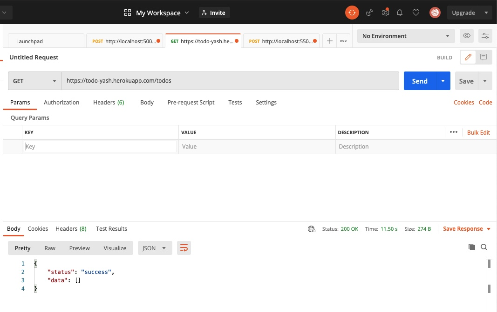

# todos-app-backend-api

Designed and Implemented a todo application(Backend APIs Only).
which support: 
1. The user is able to create/read/update/delete/set deadline for todos.
2. The user is able to search an existing todo by title/date/priority/state/deadline range.
3. The user is able to prioritize the todos.

Languages/Frameworks used: NodeJS, Postgresql.

Testing done on POSTMAN.

Backend deployed on heroku https://todo-yash.herokuapp.com/todos

# Assumptions:
1. Postgresql is installed on your system.
2. By default priority will be 1.
3. Priority of the todo item can be assigned by user.
4. Larger the integer, higher the priority.
5. By default deadline will be 1 month+ date of creation of todo item.
6. Items can have same priority.
7. Title of the todo item must be unique.
8. Port number used is 5500.

## toDoItems Schema
id  | title | description | isCompleted | priority | deadlineDate | createdAt | updatedAt

# Different routes:
1. app.get('/todos', toDoController.getTodos)
    Used to get all the Todos items.
2. app.get('/todos/incomplete', toDoController.getIncompleteTodos)
    Used to get all the Todos items which are incomplete.
3. app.get('/todos/complete', toDoController.getCompleteTodos)
    Used to get all the Todos which are completed.
4. app.get('/todos/:title', toDoController.getTodoByTitle)
    Used to get Todos item using title.
5. app.get('/todos/priority-filter/:startPriority/:endPriority', toDoController.getTodosByPriorityRange)
    Used to get all the Todos which are in the priority range mentioned.
6. app.get('/todos/deadlinedate-range-filter/:startDay/:startMonth/:startYear/:endDay/:endMonth/:endYear', toDoController.getTodosByDeadlineDateRange)
    Used to get all the Todos which are in the deadline range mentioned.
8. app.get('/todos/top-priority/:limit', toDoController.getTodosByPriority)
    Used to get top ‘n’ Todos based on priority.
9. app.patch('/todos/:title/mark-complete', toDoController.markTodoAsComplete)
    Used to update Todos item’s ‘isComplete’ attribute to ‘true’.
10. app.post('/todos', toDoController.createTodo)
    Used to add a Todos item in the table.
11. app.delete('/todos/:title',toDoController.deleteTodosbytitle)
    Used to delete a Todos item from the table using title.

# Steps to run application:
1. Make sure you have Postgresql installed on your system.
2. Clone the repository.
3. cd into the cloned repository
3. run "npm install"
4. Create a user, it's password and database, and enter them in files:

    i.  server.js and   
    ii. toDOItem.js (in models folder)
       (See comments)
3. Open terminal and Change directory to server.js's file's directory.
4. Uncomment 'line 54' from 'toDoItem.js' file (models folder), if running the application first time on your system.  
5. Type 'node server.js' and enter 
6. Comment back line 54 from 'toDOItem.js' file from models folder.
    (Otherwise it will replace the old table with a new one and all your data will get destroy)
7. Use Postman to test the application using 'localhost:5500/' and see file app.js
